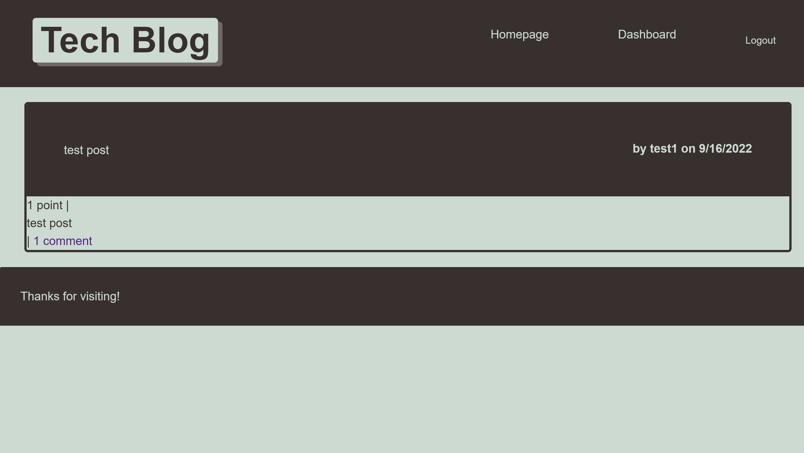

# Tech blog

This project contains a simple blog that keeps track of users, posts, and their associated data. 

The data is stored in a mySQL database created using sequalize. This allows for easy translation between writing SQL queries and JavaScript.
Users can create an account and login to interact with and create a post

Languages/Libraries used:
-
* Node.js
* mySQL
* Sequalize
* JavaScript

## Table Of Contents
* [Installation](#Installation)
* [Usage](#Usage)
* [License](#License)
* [Contributing](#Contributing)
* [Tests](#tests)
## Installation

This project is currently deployed at the following URL:
https://tech-blog-challenge.herokuapp.com/
    
## Usage/Examples

* create an account
* view the dashboard to create a new post
* click on a post's tile or comment value to see the post on its own

## License

[MIT](https://choosealicense.com/licenses/mit/)

## Contributing

This project is not currently open for contribution. If you have any questions or concerns, please make a post in the issues section.

## Authors

- [@noothanks](https://www.github.com/noothanks)

## Screenshots

